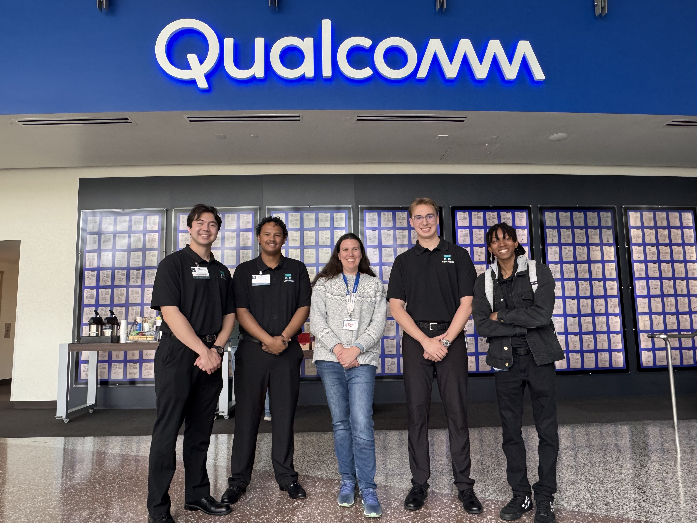
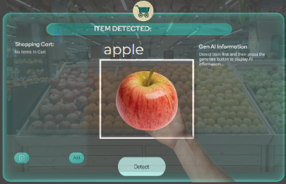
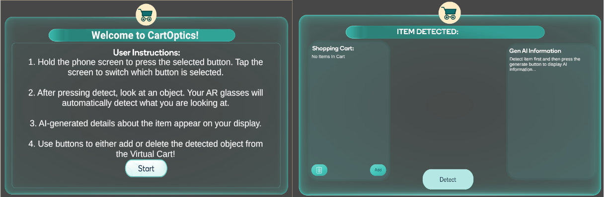

# 🛒 CartOptics – AR Grocery Assistant

An augmented reality (AR) and generative AI-powered grocery assistant developed using **Qualcomm Snapdragon Spaces** and **Unity**. Designed to transform the in-store shopping experience, CartOptics uses real-time object detection and multimodal AI to deliver contextual product information through a head-mounted display (HMD).

---

---

## 📌 Overview

**CartOptics** overlays real-time nutritional facts, pricing, and allergen data directly onto grocery items viewed through AR glasses. Combining on-device AR for spatial tracking and cloud-based AI for data generation, the system provides hands-free, personalized, and privacy-conscious assistance throughout the shopping journey.

---

## 🧠 Key Features

- 🔎 **Real-Time Object Detection** — Powered by YOLOv8n and integrated with Snapdragon Spaces for in-view recognition
- 🤖 **Generative AI Integration** — Uses Google Gemini API to deliver contextual product metadata on demand
- 🛒 **Smart Cart System** — Users can manage cart contents and view item history with screen-level overlays
- 🔁 **Dual Render Fusion** — Simultaneous rendering on AR headset and mobile device for testing and usability
- 🧭 **Minimalist AR UI** — Focused on clarity, fast response, and non-obtrusive visual presentation
- 🔐 **Privacy First** — No data stored or transmitted without user consent; GDPR/CCPA compliant architecture

---

## ⚙️ Technology Stack

- **Unity (C#)** – Core development environment
- **Snapdragon Spaces SDK** – AR integration and spatial awareness
- **YOLOv8 (Ultralytics)** – Object detection engine
- **Google Gemini API** – Generative AI pipeline
- **ONNX + Unity Barracuda** – On-device model inference
- **Git** – Version control and collaboration

---

## 🏗️ System Architecture

- **Model-View-Controller (MVC)** with clean architecture design
- **Design Patterns**:
  - *Strategy* – Modular object info generation
  - *Composite* – Smart cart item structure
  - *Singleton* – Gemini API manager
  - *Builder* – Category-specific prompt construction
- **User Interface**:
  - Screen-fixed overlays with item sliders and dynamic info cards
  - Gesture interaction and simplified cart checkout workflow

---

## 🖼️ Demo & UI

### CartOptics Branding

### In-Use Demo

### AR UI Screens

---

## 👥 Team & Acknowledgments

This project was developed as part of the **CSUSM Software Engineering Capstone**.

### Developers
- Aaron Edward Hamilton  
- Elijah Esteban Munoz  
- Kyle Anthony Beck  
- Mason Thomas Vick  

### Mentors & Support
- **Instructor**: Simon Fan  
- **Faculty Advisor**: Yongjie Zheng  
- **Industry Sponsor**: Qualcomm  
- **Mentor**: Karen Weeks  

---

## 🧪 Testing & Validation

- **NUnit** and Unity Test Framework used for automation and unit testing
- Validated key functions including:
  - Dual render fusion
  - Object recognition accuracy
  - Prompt-to-response integrity via Google Gemini
  - API call rate-limiting
  - Seamless HMD-camera feed integration

Test cases and execution reports are included in the `/testing` directory for reproducibility.

---

## 🚀 Deployment Guide

1. Clone this repository and open in Unity (2022.3+ recommended).
2. Install Snapdragon Spaces SDK and Unity Barracuda.
3. Import YOLOv8n ONNX model and integrate into object detection pipeline.
4. Add your Google Gemini API credentials in the designated script.
5. Build APK and deploy to Snapdragon Spaces-compatible Android device.
6. Connect to a Lenovo ThinkReality A3 or similar HMD for full experience.

---

## 📚 References

- [Snapdragon Spaces Documentation](https://docs.spaces.qualcomm.com/unity/)
- [Unity Barracuda Docs](https://docs.unity3d.com/Packages/com.unity.barracuda)
- [Ultralytics YOLOv8](https://docs.ultralytics.com)
- [Google Gemini API](https://developers.google.com/)

---

> CSU-SM-CSIS-30-2025-SE-001-Team-005 • February 2025 • Version 5.0
